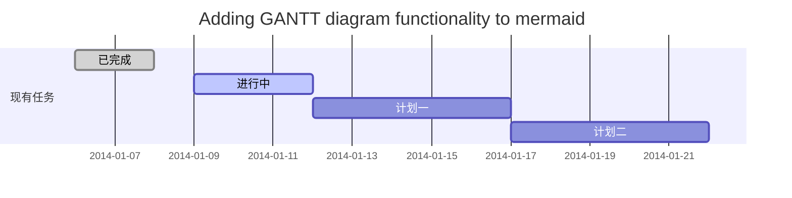
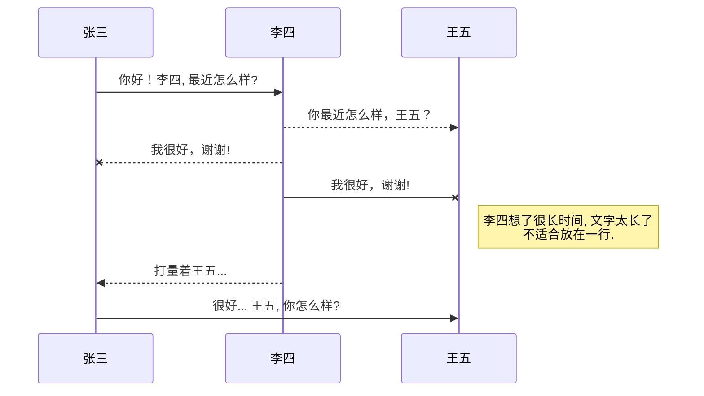
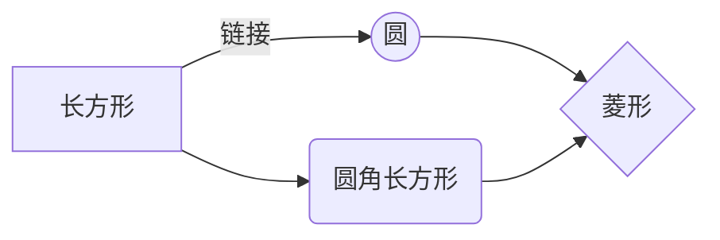
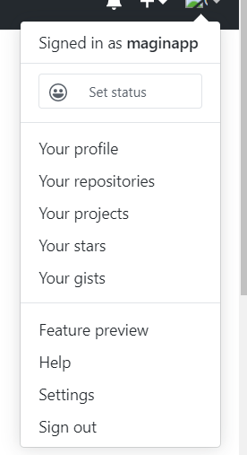

---
meta:
  - name: keywords
    content: vuepress,博客,个人网站
  - name: description
    content: vuepress搭建网站踩坑
---

# vuepress搭建网站踩坑

## 准备

* node.js >= 8.6 本地开发环境搭建

* [vuepress](https://www.vuepress.cn/)

* markdown语法

### 获取token，用于travis构建发布权限配置

> 个人账户 > developer settings > Personal access tokens > add

配置token，暂时未研究具体权限需求，提供了除删除仓库外的所有权限


### [travis-ci](https://travis-ci.org/)注册

使用github同步账户数据

> setting页配置需要同步到travis的仓库 > 进入对应的仓库settings配置 Environment Variables（键值对）

配置的键名: 项目中的[.travis.yml](#travis-部署)文件中 github_token所配置的变量名对应
值：上一步的token，考虑到安全性问题，设置为不可见


## 开始


### github创建仓库

### 项目仓库设置

> settings > options > GitHub Pages > sources修改访问资源 `gh-pages`

使用travis构建后，会自动想仓库推送打包后的gh-pages分钟，切换到该分支后，即可访问  `https://<username>.github.io/<repository name>/`

### .vuepress > config.js设置

base: 设置为仓库名 `<repository name>`

dest: 打包后的地址 默认 `<资源文件夹>/.vuepress/dist`

## 部署

### travis 部署

> 本项目使用 `travis` 部署

项目添加.travis.yml文件，[参考](https://vuepress.vuejs.org/zh/guide/deploy.html#github-pages)

``` yml{12}
language: node_js
node_js:
  - lts/*
install:
  - npm ci
script:
  - npm run build
deploy:
  provider: pages
  skip_cleanup: true
  local_dir: docs/.vuepress/dist
  github_token: $GITHUB_TOKEN # 在 GitHub 中生成，用于允许 Travis 向你的仓库推送代码。在 Travis 的项目设置页面进行配置，设置为 secure variable
  keep_history: true
  on:
    branch: master
```

### deploy.sh

配置 deploy.sh ，[参考](https://vuepress.vuejs.org/zh/guide/deploy.html#github-pages)

``` sh{13,20,23}
#!/usr/bin/env sh

# 确保脚本抛出遇到的错误
set -e

# 生成静态文件
npm run docs:build

# 进入生成的文件夹
cd docs/.vuepress/dist

# 如果是发布到自定义域名
# echo 'www.example.com' > CNAME

git init
git add -A
git commit -m 'deploy'

# 如果发布到 https://<USERNAME>.github.io
# git push -f git@github.com:<USERNAME>/<USERNAME>.github.io.git master

# 如果发布到 https://<USERNAME>.github.io/<REPO>
git push -f git@github.com:maginapp/sharing-technology-article.git master:gh-pages

cd -
```

## vuepress非官方插件

为同步博客到csdn，添加了对`katex数学公式`、`甘特图`和`flowchart`的支持

### [@maginapp/vuepress-plugin-katex](https://github.com/maginapp/vuepress-plugin-katex)


行内公式:  $\Gamma(z) = \int_0^\infty t^{z-1}e^{-t}dt\,.$ 

$$
\Gamma(z) = \int_0^\infty t^{z-1}e^{-t}dt\,.
$$

```
行内公式:  $\Gamma(z) = \int_0^\infty t^{z-1}e^{-t}dt\,.$ 

$$
\Gamma(z) = \int_0^\infty t^{z-1}e^{-t}dt\,.
$$
```

### [vuepress-plugin-mermaidjs](https://github.com/eFrane/vuepress-plugin-mermaidjs)



```md
\```mermaid
gantt
        dateFormat  YYYY-MM-DD
        title Adding GANTT diagram functionality to mermaid
        section 现有任务
        已完成               :done,    des1, 2014-01-06,2014-01-08
        进行中               :active,  des2, 2014-01-09, 3d
        计划一               :         des3, after des2, 5d
        计划二               :         des4, after des3, 5d
\```
```






### [@maginapp/vuepress-plugin-flowchart](https://github.com/maginappvuepress/vuepress-plugin-flowchart)

基于(ulivz/vuepress-plugin-flowchart)[https://github.com/ulivz/vuepress-plugin-flowchart
]做了改写，兼容了csdn博客的flowchart模板

```mermaid
flowchat
st=>start: 启1动11 <ImgWIthBase /> $\Gamma(z) = \int_0^\infty t^{z-1}e^{-t}dt\,.$ 
e=>end: 结束
op=>operation: 我的操作
cond=>condition: 确认？

st->op->cond
cond(yes)->e
cond(no)->op
```

### znicholasbrown/vuepress-plugin-code-copy

[znicholasbrown/vuepress-plugin-code-copy](https://github.com/znicholasbrown/vuepress-plugin-code-copy)试下代码复制功能

usage

```js
module.exports = {
    plugins: [['vuepress-plugin-code-copy', true]]
}
module.exports = {
  plugins: [
    ["vuepress-plugin-code-copy", {
        selector: String,
        align: String,
        color: String,
        backgroundTransition: Boolean,
        backgroundColor: String,
        successText: String
        }
    ]
  ]
}
```

### @vssue/vuepress-plugin-vssue

[vssue评论功能](./vuepress-plugin-introduce.html#vssue评论功能)

## tips/md语法扩展

### sidebar 路径设置

* '/test/': 查找test文件夹下的index.html

* '/test': test.html test/index.html

### 静态资源-图片路径


* 根据[vuepress官网配置](https://vuepress.vuejs.org/zh/guide/assets.html#%E7%9B%B8%E5%AF%B9%E8%B7%AF%E5%BE%84)了alias，`~@alias` 配置是生效的

  * 使用绝对路径，会在node_module中查找

  * 使用相对路径，需要注意md文件和资源的相对位置

  ```js
  configureWebpack: {
    resolve: {
      alias: {
        '@alias': '../../../assets/images', // /docs/blog/about-config/md 文件中使用
        '@alias-p': '../../assets/images' // /docs/blog/md 文件中使用
      }
    }
  }
  ```

* vue组件使用图片

  * 组件中直接引用的静态图片打包到`assets/img/`或者base64格式

  * md中使用的vue组件，建议传入`http(s)`或者以`.vuepress/public`为根目录的相对地址`/webstatic/5.png`

  * `.vuepress/config.js`配置了`base`属性后，需要使用动态写法，加入$withBase()
  
  > base 路径一旦被设置，它将会自动地作为前缀插入到 .vuepress/config.js 中所有以 / 开始的资源路径中。

* 静态写法
  
  *  `./路径` 直接使用相对路径，以当前md文件为基准

  * `/路径`，以`.vuepress/config.js`为根目录

* 放置在`.vuepress/public`中的资源会直接打包到根目录中

  * 以`.vuepress/public`为根目录写地址即可

  * 资源会直接复制到根目录


<ImgWithBase src="/webstatic/5.png" alt="ImgWithBase: /webstatic/5.png"/>





)


``

 

<ImgWithBase src="./7.png" alt="ImgWithBase: ./7.png"/>

`<ImgWithBase src="7.png" alt="ImgWithBase: 7.png"/>`


```md


<ImgWithBase src="/webstatic/5.png" alt="ImgWithBase: /webstatic/5.png"/>


> 以上 dev 环境成功

)


``

 

<ImgWithBase src="./7.png" alt="ImgWithBase: ./7.png"/>

`<ImgWithBase src="7.png" alt="ImgWithBase: 7.png"/>`


```

```{2,5}
# .vuepress/public
test.png

# md文件

```

### favivon 设置

config.js 设置

``` js
head: [
    ['link', { rel: 'shortcut icon', type: "image/x-icon", href: `/favicon.ico` }]
]
```

### 代码高亮显示

```{1}
``` type{行号,行号}
1
3
测试
```

### [emoji](https://github.com/markdown-it/markdown-it-emoji/blob/master/lib/data/full.json)

```
:tada: :100:
```
:tada: :100:

### 自定义容器

``` md
::: tip
这是一个提示
:::

::: warning
这是一个警告
:::

::: danger 提示标题 
这是一个危险警告
:::

类似 <summary> <details>
::: details 标题
这是一个详情块，在 IE / Edge 中不生效
:::
```

::: tip
这是一个提示
:::

::: warning
这是一个警告
:::

::: danger error
这是一个危险警告
:::

::: details 点击查看代码
这是一个详情块，在 IE / Edge 中不生效
:::

## 引用

* [使用travis-ci自动部署github上的项目](https://www.cnblogs.com/morang/p/7228488.html)

* [travis ci 自动部署](https://blog.csdn.net/hanziyuan08/article/details/82919454)
